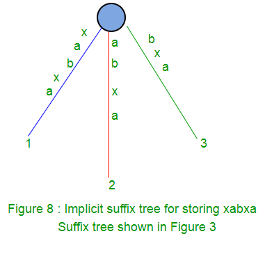
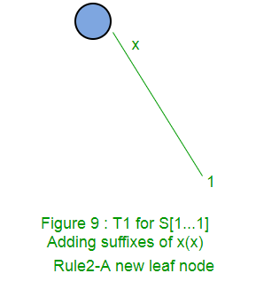
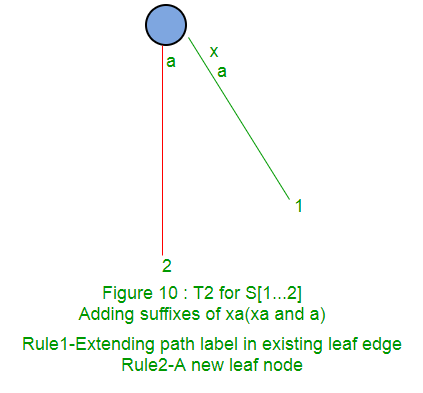
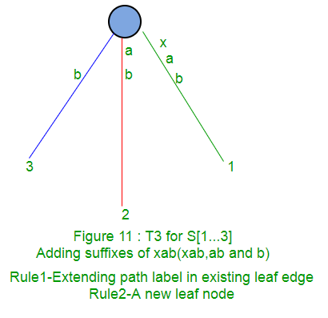
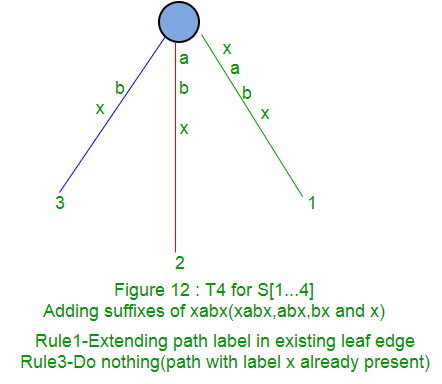
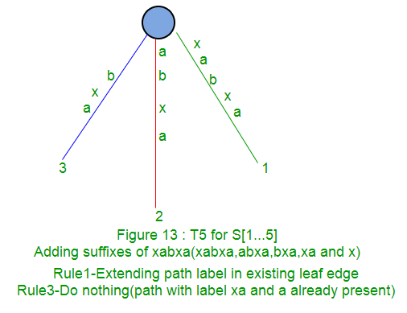
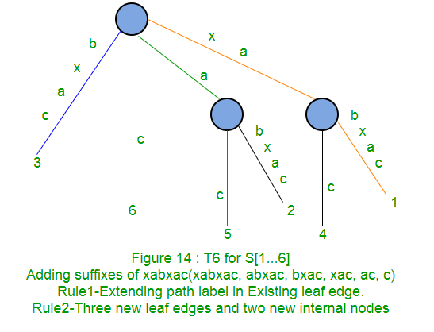

# Ukkonen's Suffix Tree Construction Part1

## 隐式后缀树（Implicit Suffix Tree）

在构建后缀树的时候，我们会在构建的步骤中见到隐式后缀树。在隐式后缀树中，没有$（或者#等表示结尾的）符号，没有中间节点，只有根节点和几条单一的边。

要从一个后缀树$S\$$得到一个隐式后缀树：

- 把树中所有的$符号删除
- 删掉所有没有字符的边
- 删掉只有一条出去的边的所有节点，并将该节点的两条边合并




## High Level Description

UKK算法的主要思想是，对字符串S的每一个前缀$$S[1...i]$$，构建它的隐式后缀树$$Ti$$。它首先使用第一个字符构建$T1$，然后使用前两个字符构建$T2$，使用前m个字符构建$Tm$。在任何时候，Ukk的算法都会使用到目前为止看到的字符构建后缀树，因此它具有一些即时的属性。

- UKK算法主要分为m个阶段，每个阶段往后移动一个字符，总共m个字符。在阶段$i+1​$， $T(i+1)​$基于$Ti​$构建
- 在每个$i+1$阶段，又需要进一步分为$i+1$步骤，每个步骤对字符串$S[1...i+1]$的某一个后缀子串进行处理
- 在第$i+1$阶段的第$j$步骤中，算法首先找到从根节点出发的一条路径，路劲表示字串$S[j...i]$，然后将字符$S(i+1)$添加到路径中
- 在第$i+1$阶段的第一步中，将子串$$S[1...i+1]$$添加到树中。这时候子串$S[1...i]$已经在第$i$阶段中构建好了，只需要添加末尾的一个字符就好了
- 在第$i+1$阶段的第二步中，将子串$S[2...i+1]$添加到树中。这时候子串$S[2...i]$已经在第$i$阶段中构建好了，只需要添加末尾的一个字符就好了
- 同上

#### 伪代码

```
Construct tree T1
For i from 1 to m-1 do
begin {phase i+1}
	For j from 1 to i+1
	begin {extension j}
		Find the end of the path from the root labelled S[j..i] in the current tree.
    	Extend that path by adding character S[i+l] if it is not there already
   	end;
end;
```

在每一步extension的过程中，有三个规则：

- **rule1**: 如果标记为$S[j...i]$的路径的结尾是叶子，那么 直接将字符$S(i+1)$添加到叶子上即可
- **rule2**：如果标记为$S[j...i]$的路径的结尾不是叶子，并且它的下一个字符不是$S(i+1)$，那么就从字符$S[i + 1]$开始创建标签为$S[i+1]$且编号为$j$的新叶边
- **rule3**：如果标记为$S[j...i]$的路径的结尾不是叶子，并且它的下一个字符是$S(i+1)$.不做任何事

这里需要注意的一点是，从给定节点（根或内部）开始，将有一个且只有一个边从一个字符开始。 从相同的字符开始，任何节点都不会有多个边。

#### example for 'xabxac'













