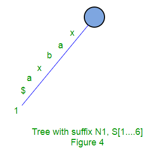
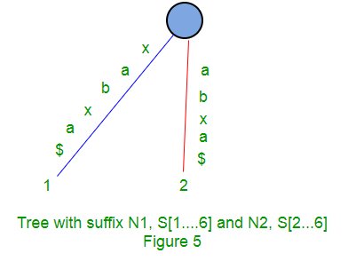
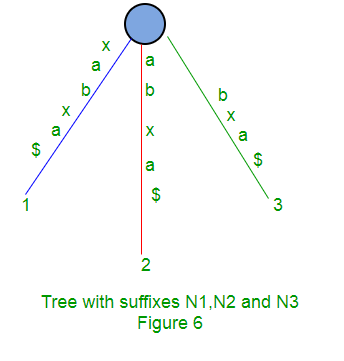
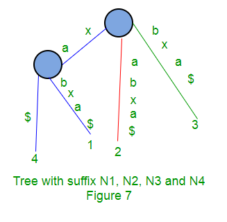

# Suffix Tree

之前研究过suffix array, suffix array和suffix tree基本上是一样的作用，任何可以用suffix tree解决的办法都能用suffix array来解决。但是suffix array在时间复杂度上要比suffix tree多得多，而且我觉得真的不如直接用后缀树来解决。

为什么呢？因为构建一个后缀树所需要的时间复杂度仅为O(n)，而且也便于理解。

### 概念

**一个给定的字符串text，它的后缀树其实是它的所有后缀的Compressed Tries（压缩特里结构）**。我们先理解一下什么是Compressed Tries：

对于一个文本的集合：

```markdown
{bear, bell, bid, bull, buy, sell, stock, stop}
```

这个集合的Standard Tries如下图：


可以看到每条从根节点到叶子节点的路径都表示一个字符串。Compressed Tries就是将Standard Tries压缩之后得到的结果，压缩就是指将之后一个节点的链路合并起来，如下图：


那么这和后缀树有什么关系呢？又怎样构建一个后缀树呢？

其实，对于一个字符串‘banana’，它的所有后缀构成了一个集合（\0表示字符串的结尾）：

```markdown
{banana\0, anana\0, nana\0, ana\0, na\0, a\0, \0}
```

那么这个集合的Standard Tries就是：


我们把这个树压缩：


得到的这个树就是传说中的后缀树了。


### 定义

对于一个长度为n的字符串S，有这样一颗树：

- 这棵树恰好有n个叶子节点；
- 除了根节点以外，每个内部节点至少有两个以上的子节点；
- 每条边都有S的某个非空字串标记；
- **从某一个节点出发的两条边，它们的其实字符不可能一样**；
- 每条从根节点到叶子节点i的路径构成了S的一个后缀$S[i, n]$；


### 实现

#### 原始办法

给定一个长度为m的字符串S，向后缀树中插入一条边$S[1 ...m]\$(字符串本身)$，然后依次向树中插入后缀$S[i ...m]\$(i=2, 3, ..., m)$. 我们用$Ni$表示已经插入了$i$个后缀的树 ：

所以，$Ni+1$可以由$Ni$构建：

- 从$Ni$的根节点开始；
- 找到一条路径，这条路径所表示的后缀字串$S[k..m]\$$，可以匹配后缀$S[i+1...m]\$$，它们具有一段相同的前缀；
- 匹配的结尾要么在某个节点（假设为w）处，或者在某条边（假设为（u，v））的中间；
- 如过是在边（u，v）的中间，那么将这条边拆分，并将新的节点w插入到匹配到的最后一个字符的后面。形成的新边（u，w）就是原有的（u，v）的一部分，并且它代表后缀字串$S[i+1...m]\$$。边（w，v）就是原有（u，v）剩下未匹配的部分
- 从节点w处创建一条新边（w, i+1），i+1作为新的叶子节点，这条边的标记就是后缀字串$S[i+1...m]\$$未匹配的部分

这个算法时间复杂度是O(m^2)，因为每次插入新的后缀字串时，都需要遍历所有的路径从而找到匹配的路径，一共需要插入m次。

举个例子，构建“xabxa$”的后缀树时，需要以下的步骤：

1. 构建一条边，表示这个字符串自己：

   

2. 在原有基础上，插入$S[i...m]\$$:

   

3. 插入bxa

   

4. 插入xa，发现和1边有匹配的部分，拆分:

   

这个办法比较笨，没有代码实现=_=。


#### Ukkonen's Suffix Tree Construction

[ukkonen's suffix tree construction - part1](./Ukkonen's Suffix Tree Construction.md)


